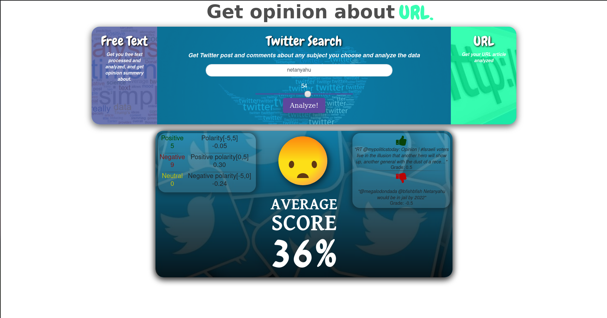

# Sentimental Analysis Web Tool




### Live Demo
https://tweets-sanalysis.herokuapp.com/


### Introduction
Web app helps you to collect latest opinion by Twitter comments. 

### Features
* Analyze latest twitter posts by any query you like.
* Analyze free text positivity
* Analyze text opinion by given URL 


### Technologies
Project created with:
* NodeJS
* ExpressJS
* Twitter API

### Setup
To run this project, install it locally using npm:
```
$ npm install
$ npm start
```
